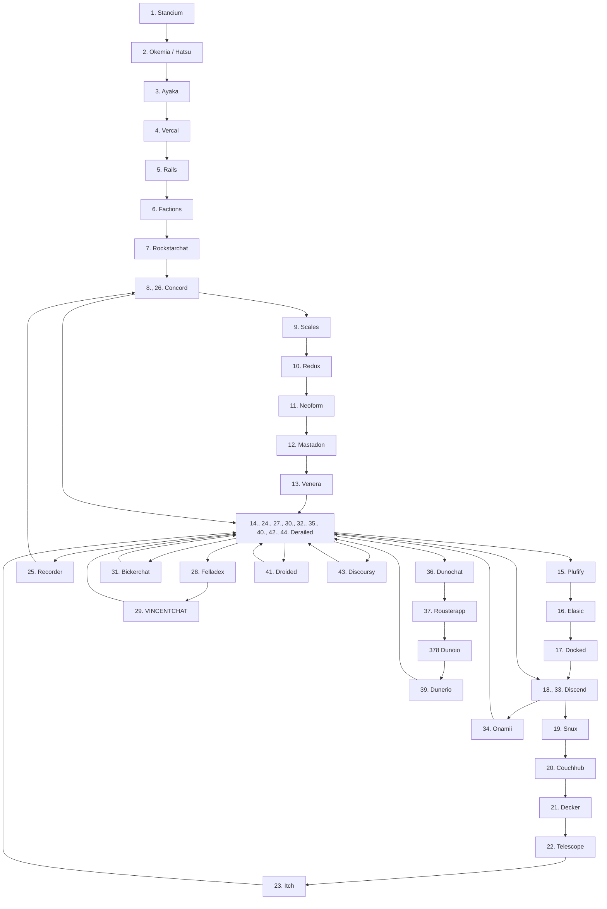

The rather turbulent name history of a chat app made by vincent.
The rather turbulent name history of a chat app made by vincent.

| No. | Name         | Date with link                                                                                                                                                                        | Days lasted |
|:---:|:-------------|:--------------------------------------------------------------------------------------------------------------------------------------------------------------------------------------|------------:|
|  1  | Stancium     | [2021-12-08](https://github.com/decker-archive/api/commit/d37cab03ecc9ce0c4343052464a8006837c2bbe6)                                                                                   |          71 |
|  2  | Okemia/Hatsu | [2022-02-17](https://github.com/decker-archive/api/commit/bf0549264018319595e10b393a5762334cc4f31a)                                                                                   |          23 |
|  3  | Ayaka        | [2022-03-12](https://github.com/concordchat/api-docs/commit/ea8034a983003808c6df91c6c49cc21e8f72d858)                                                                                 |           1 |
|  4  | Vercal       | [2022-03-13](https://github.com/decker-archive/api/commit/050074b9ac3da41eb4852877b1ab46a0915c8817)                                                                                   |           4 |
|  5  | Rails        | [2022-03-17](https://github.com/decker-archive/api/commit/08f8ecb45e20014627295e1bb54c1a2644301d2c)                                                                                   |           4 |
|  6  | Factions     | [2022-03-21](https://github.com/concordchat/concord-api/commit/e539f7191fe8d70f9f8a77fb9a1b973541617a46)                                                                              |          13 |
|  7  | Rockstarchat | [2022-04-03](https://github.com/concordchat-legacy/concord-api/commit/6819f6eae4a99dfdafee05e9296b438c0b49c6ca#diff-798137c7a240014f6b92491f629b75edbfea5ca76dc8bdfdeecdcfa736e21da5) |          10 |
|  8  | Concord      | [2022-04-13](https://canary.discord.com/channels/881118111967883295/881118112492191796/963795519711367168)                                                                            |          17 |
|  9  | Scales       | [2022-04-30](https://canary.discord.com/channels/881118111967883295/881118112492191796/969865722991869982)                                                                            |           3 |
| 10  | Redux        | [2022-05-03](https://canary.discord.com/channels/881118111967883295/969836504128036864/970955845695324190)                                                                            |          16 |
| 11  | Neoform      | [2022-05-19](https://github.com/concordchat/concord-api/commit/6c8003a077145dd9ae383b9b513fd685e6c2f066)                                                                              |           4 |
| 12  | Mastadon     | [2022-05-23](https://canary.discord.com/channels/881118111967883295/881118112492191796/978299567256797234)                                                                            |           2 |
| 13  | Venera       | [2022-05-25](https://canary.discord.com/channels/962194292296802334/962194292296802337/979015020316868669)                                                                            |          41 |
| 14  | Derailed     | [2022-07-05](https://github.com/decker-archive/backend/commit/7b6c9420a0267762e040e9a541f29a5747f96dcd)                                                                               |           4 |
| 15  | Plufify      | [2022-07-09](https://github.com/decker-archive/backend/commit/b174d2af013095bce4d06961e25f3e268b013b6f)                                                                               |          28 |
| 16  | Elasic       | [2022-08-06](https://github.com/deckerapp/decker-gateway/commit/c751b61b7da63877e231d15109d1358ddde11193)                                                                             |           1 |
| 17  | Docked       | [2022-08-07](https://canary.discord.com/channels/881118111967883295/881118112492191796/1005799500956323861)                                                                           |           2 |
| 18  | Discend      | [2022-08-09](https://canary.discord.com/channels/962194292296802334/988243874201862144/1006538875981799484)                                                                           |           2 |
| 19  | Snux         | [2022-08-11](https://canary.discord.com/channels/962194292296802334/988243874201862144/1007175454622490705)                                                                           |           2 |
| 20  | Couchhub     | [2022-08-13](https://github.com/deckerapp/decker-api/commit/ec2e9e191c3f599d1c4fbd8e8736be458967c487)                                                                                 |           1 |
| 21  | Decker       | [2022-08-14](https://canary.discord.com/channels/881118111967883295/881118112492191796/1008358169594048532)                                                                           |           3 |
| 22  | Telescope    | [2022-08-17](https://prnt.sc/vKodrdgCix6M)                                                                                                                                            |           0 |
| 23  | Itch         | [2022-08-17](https://prnt.sc/FXkEyTVPULlS)                                                                                                                                            |           1 |
| 24  | Derailed     | [2022-08-18](https://prnt.sc/kBW_ttEEzPnh)                                                                                                                                            |           5 |
| 25  | Recorder     | [2022-08-23](https://prnt.sc/z8jW8QhW5lcL)                                                                                                                                            |           2 |
| 26  | Concord      | [2022-08-25](https://prnt.sc/WZSED6E4a934)                                                                                                                                            |           3 |
| 27  | Derailed     | [2022-08-28](https://prnt.sc/4Z6n3HfAwvUH)                                                                                                                                            |           3 |
| 28  | Felladex     | [2022-08-31](https://prnt.sc/Wv5QwdNWspzZ)                                                                                                                                            |           1 |
| 29  | VINCENTCHAT  | [2022-09-01](https://prnt.sc/NDmSsU1PWa4W)                                                                                                                                            |           2 |
| 30  | Derailed     | [2022-09-03](https://prnt.sc/7Lyr7dgc6zbn)                                                                                                                                            |           2 |
| 31  | Bickerchat   | [2022-09-05](https://prnt.sc/XBgDmvX8T8-a)                                                                                                                                            |           0 |
| 32  | Derailed     | [2022-09-05](https://prnt.sc/XVDv59_w4jKU)                                                                                                                                            |           4 |
| 33  | Discend      | [2022-09-09](https://prnt.sc/6lIYAbxxSDVA)                                                                                                                                            |           0 |
| 34  | Onamii       | [2022-09-09](https://prnt.sc/uq1wrYfPlPGW)                                                                                                                                            |           0 |
| 35  | Derailed     | [2022-09-09](https://prnt.sc/ToTSTSPMKZkF)                                                                                                                                            |           2 |
| 36  | Dunochat     | [2022-09-11](https://prnt.sc/ik8NJ2g_PEt1)                                                                                                                                            |           0 |
| 37  | Rousterapp   | [2022-09-11](https://prnt.sc/kNx-9Q7TH7U8)                                                                                                                                            |           0 |
| 38  | Dunoio       | [2022-09-11](https://prnt.sc/MwqicqyDApo7)                                                                                                                                            |           0 |
| 39  | Dunerio      | [2022-09-11](https://prnt.sc/m-f5x7_VAd_4)                                                                                                                                            |           1 |
| 40  | Derailed     | [2022-09-12](https://prnt.sc/-_Jk_i1zQVm4)                                                                                                                                            |           0 |
| 41  | Droided      | [2022-09-12](https://prnt.sc/TRxRfCQ703yA)                                                                                                                                            |           1 |
| 42  | Derailed     | [2022-09-13](https://prnt.sc/IuAJ5YERqv2D)                                                                                                                                            |          79 |
| 43  | Discoursy    | [2022-12-01](https://prnt.sc/ECAG_vXAaTWk)                                                                                                                                            |          16 |
| 44  | Derailed     | [2022-12-17](https://prnt.sc/Szu0qAShTQaH)                                                                                                                                            | counting... |

